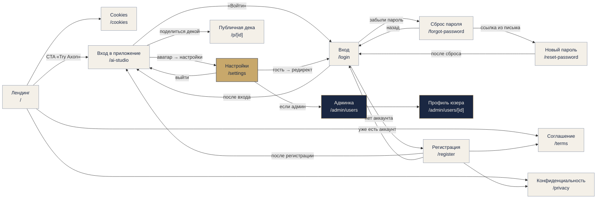

# App Map — Axon

> Карта всех маршрутов с ролями доступа + диаграмма переходов. По фактическому
> состоянию кода на 2026-06-23 (Урок 7, Шаг 1). Интерактивная версия — [`app-map.html`](app-map.html).

## Топология (важно)

Два отдельных Next.js-приложения живут на **одном домене** `axon-app.ru`, nginx делит по пути
([ADR-010](decisions/ADR-010-app-url.md)):

| Приложение | Код | Адрес |
|---|---|---|
| **Лендинг** (маркетинг) | `development/apps/landing/app/` | `axon-app.ru/` |
| **Сервис** (продукт) | `development/apps/app/app/` | `axon-app.ru/ai-studio` (`basePath`) |

Из-за `basePath` все маршруты сервиса ниже физически открываются с приставкой `/ai-studio`
(например, `/login` → `axon-app.ru/ai-studio/login`). В таблицах путь дан **без приставки** —
так, как он лежит в роутере Next.js. **Защита доступа — без middleware:** гейт стоит на самих
серверных страницах/действиях (см. «Глобальные правила доступа»).

## Маршруты и доступ

### Лендинг (`apps/landing`, `axon-app.ru/`)

| URL | Экран | Доступ | Описание |
|---|---|---|---|
| `/` | Маркетинговый лендинг | все (гость) | Промо-страница: Hero, секции, FAQ, CTA → сервис |
| `/privacy` | Политика конфиденциальности | все | Юр-страница (152-ФЗ) |
| `/terms` | Пользовательское соглашение | все | Юр-страница |
| `/cookies` | Политика cookies | все | Юр-страница |

### Сервис (`apps/app`, `axon-app.ru/ai-studio`)

| URL | Экран | Доступ | Описание |
|---|---|---|---|
| `/` | Вход в приложение → рабочая область | все (гость + вошедший) | Клиентский переключатель `view`: **landing-вью** (intro, dropzone, Recent Projects) ↔ **workspace** (холст). Сохранение проекта требует входа |
| `/login` | Вход | только гость | Форма входа (Better Auth) |
| `/register` | Регистрация | только гость | Форма регистрации + чекбокс согласия (`/terms`, `/privacy`) |
| `/forgot-password` | Запрос сброса пароля | только гость | Ввод email → письмо со ссылкой |
| `/reset-password` | Новый пароль | гость по токену из письма | Установка нового пароля |
| `/settings` | Настройки аккаунта | только вошедший | Имя, пароль, аватар, удаление, выход. Вход в админку (если админ) |
| `/admin/users` | Админка: список пользователей | только админ | Read-only сводка + список + поиск (v1) |
| `/admin/users/[id]` | Админка: профиль пользователя | только админ | Read-only профиль + доски пользователя |
| `/p/[id]` | Публичная презентация | все по приватной ссылке | Read-only показ деки по токену шаринга, **вход не нужен** |
| `/storybook` | Витрина дизайн-системы | все (внутреннее) | UI-kit: токены + компоненты. Без гейта; не в навигации, для разработки |

**Режимы внутри workspace (`/`, не маршруты)** — переключаются клиентским состоянием `mode`:
Data/Canvas (`mode=data`) · Presentation/Slides (`mode=presentation`) · Build/Present (`mode=build`),
плюс drill-in-оверлеи инсайта и дата-сета.

## Карта переходов (Mermaid)

## UI-состояния (для каждого экрана)

| Экран | Загрузка | Пустой | Заполненный | Ошибка |
|---|---|---|---|---|
| `/` (workspace) | спиннер при загрузке доски (`BoardSync`) | landing-вью с dropzone, нет Recent Projects | холст с инсайтами/дата-сетами/слайдами | тост об ошибке разбора/сети |
| `/login`, `/register` | кнопка `loading` (disabled) | пустая форма | заполненные поля | сообщение об ошибке под формой |
| `/forgot-password`, `/reset-password` | кнопка `loading` | пустая форма | заполнено | ошибка валидации/токена |
| `/settings` | серверный рендер сессии | — | данные аккаунта | ошибка действия (тост) |
| `/admin/users` | `force-dynamic` рендер | список пуст / нет результатов поиска | таблица аккаунтов | не-админ → 404 |
| `/p/[id]` | серверная загрузка по токену | — | слайды деки | невалидный токен → «Презентация недоступна» |

## Глобальные правила доступа

- **Middleware нет.** Доступ проверяется на самих серверных страницах и в server-actions.
- `/settings` — `auth.api.getSession`; нет сессии → `redirect("/login")`.
- `/admin/users` и `/admin/users/[id]` — `getAdminSession()` (по env `ADMIN_EMAIL`); не-админ → `notFound()` (404, скрываем существование).
- Холст `/` открыт **гостю** (демо/работа с seed-данными); сохранение проекта требует входа (`GuestSaveButton` → `AuthModal`).
- `/p/[id]` — read-only по приватному токену, без входа.
- Server-actions досок (`app/actions/board.ts`) гейтят по `ownerId` (нет сессии или чужая доска → пусто).
- Весь сервис — `robots: { index: false }`; в поиск попадает только лендинг.

## Админ-зона

Реализована (v1, read-only): `/admin/users` (список + сводка + поиск) и `/admin/users/[id]`
(профиль + доски). Вход — со страницы `/settings` (ссылка видна только админу). Роль определяется
по env `ADMIN_EMAIL`; роль в БД (`User.role`) запланирована после Урока 7 (см. [`backlog.md`](backlog.md)).

## API без UI (для справки)

Не показаны на карте переходов (вызываются кодом, не пользователем): `api/auth/[...all]`
(Better Auth), `api/ai/extract`, `api/ai/chat` (только вошедшим), `api/avatar`, `api/files/[...key]`
(только вошедшим, защита от path-traversal).

---

> **Заметка (смежное, код не трогал):** в `/register` ссылки на `/terms` и `/privacy` —
> внутренние `<Link>` сервиса, поэтому под `basePath` они резолвятся в `/ai-studio/terms`,
> которых в сервисе нет (юр-страницы живут на лендинге). Стоит проверить и при необходимости
> вынести в backlog.
